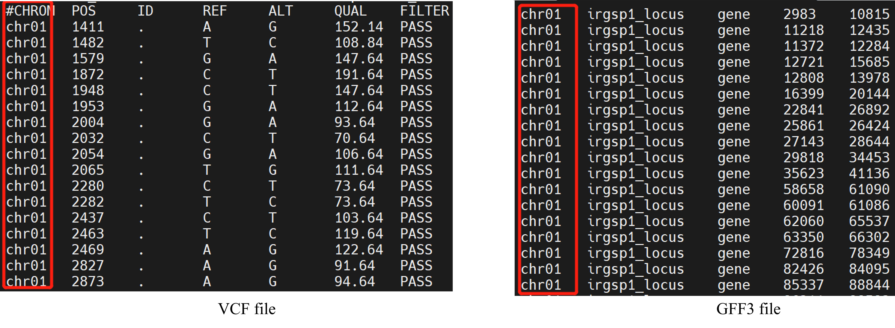

# Genic SNP Composition Tool (GSCtool)
<<<<<<< HEAD

The first genomic descriptor that characterizes genomes in a time-series manner. This tool counts the single nucleotide polymorphisms (SNPs) of genes from a variant call format (VCF) file based on a genomic general feature format (GFF3) file (Figure 1).

=======

The first genic descriptor characterizes the genome in a time-series pattern. It counts the single nucleotide polymorphisms (SNPs) of genes from variant call format (VCF) file based on genomic general feature format(GFF3) file (as shown in Figure 1).
>>>>>>> 44ba19378e3c02ac34a20f49721bbbe8852436e8


<center>Figure 1. The flow that GSCtool extracts the information from the specific files</center>

## Introdcution

<<<<<<< HEAD
Genomic variants may result in the functional change of a gene. As the number of SNPs in a gene increases, the change rate of function will be higher. Based on the concept of conserved sequences, we concluded that the number of mutations on a gene can also be used as a feature. Therefore, we developed a genomic descriptor that calculated the number of SNPs per gene as the genomic feature. To develop the descriptor, the location information of SNPs needs to be collected for each gene. The VCF file is a text file that stores the variations at a whole-genome level. However, it does not record in which genes the SNPs are located.
The annotated VCF file and GFF3 file  following two files would contain both location and gene information of SNPs. For two different populations, the annotated VCF file would generate inconsistent feature space because of different variants. The GFF3 file is used to describe the structure and location of each gene. Therefore, we developed the descriptor GSCtool to count the number of SNPs in the VCF file based on the gene information from the GFF3 file to characterize the genome (as shown in Figure 1).  The physical location of genes on chromosomes is ordered. The features generated by GSCtool can be considered a time-series(Figure 1).The GSCtool is defined as follows：
=======
Genomic variants may result in the functional change of a gene. As the number of SNPs in a gene increasing, the changing rate of function will be higher. Based on the concept of conserved sequence, we conclude that the number of mutations on a gene can also be used as a feature. Therefore, we intend to develop a descriptor that calculating the number of SNPs in per gene as the genomic features. To develop the descritptor, we need to collect the location inforamtion of SNPs in each gene. The VCF file is a text file that storing the variations at a whole genome level. However, it does not record in which genes the SNPs are located. Combining following two files would contain both location and gene information of SNPs:

1. Annotated VCF file;
2. GFF3 File;

For two different populations, the annotated VCF file would generate inconsistent feature space due to different variants. The GFF3 file is used for describing the stucture and location of each gene. Therefore, we developed the descriptor, named GSCtool, that counting the number of SNPs from VCF file based on the genes information from GFF3 file to characterize the genome (as shown in Figure 1). The physical location of genes on chromosomes is ordered. The features generated by GSCtool can be regarded as time-series(Figure 1).The detailed formula of GSCtool is defined as follows：
>>>>>>> 44ba19378e3c02ac34a20f49721bbbe8852436e8

$$
F=Vector\left(G_1,G_2\ldots G_n\right)
$$

$$
G_i=Count\left(SNP_{i_0},SNP_{i_1}\ldots S N P_{i_n}\right)
$$

<<<<<<< HEAD
where $G_i$ represents the SNP frequency ( $Count\left(SNP_{i_0},SNP_{i_1}\ldots SNP_{i_n}\right)$ ) of $Gene_i$, $F$ includes SNP frequency of all genes ( $G_1,G_2\ldots G_n$ ) in the genome.
=======
where $G_i$ represents the SNPs frequency ( $Count\left(SNP_{i_0},SNP_{i_1}\ldots SNP_{i_n}\right)$ ) of $Gene_i$, $F$ includes SNPs frequency of all genes ( $G_1,G_2\ldots G_n$ ) on the genome.
>>>>>>> 44ba19378e3c02ac34a20f49721bbbe8852436e8

## Usage

This script takes as input a VCF file(compressed) and a GFF3 File.

```bash
$ python genome_descriptor.py --help
usage: genome_descriptor.py [-h] --gzvcf GZVCF --gff3 GFF3 --outfile OUTFILE

<<<<<<< HEAD
The first genomic descriptor that characterizes genomes in a time-series manner. This tool counts the single nucleotide polymorphisms (SNPs) of genes from a variant call format (VCF) file based on a genomic general feature format (GFF3) file.
=======
The genic descriptor characterizes the genome in a time-series manner. The script counts the number of
single nucleotide polymorphisms(SNPs) in per geneid of VCF files depend on
GFF3 record.
>>>>>>> 44ba19378e3c02ac34a20f49721bbbe8852436e8

optional arguments:
  -h, --help         show this help message and exit
  --gzvcf GZVCF      The gzvcf file of individual or population
  --gff3 GFF3        The gff3 file which corresponds to the spieces of the gzvcf
  --outfile OUTFILE  The name of output file with csv format, which records the features of genome
```

**Note**: “CHROM” of VCF is consistent with the seqid of GFF3 or the name of the chromosome or scaffold. As shown in Figure 2, “CHROM” of VCF (red box of VCF file) is chr01, chr02 .... chrxx; similarly, the seqid of GFF3 (red box of GFF3) are also chr01, chr02 .... chrxx.



<center>Figure 2</center>

## Example

Extracting features from a population:

```bash
python3 genome_descriptor.py --gzvcf data/rice_population.vcf.gz --gff3 GFF3/rice.gff --outfile features/rice_population_features.csv
```

Extracting features from individuals

```bash
# rice 
python3 genome_descriptor.py --gzvcf data/rice_individual.vcf.gz --gff3 GFF3/rice.gff --outfile features/rice_individual_features.csv
# homo sapiens
python3 genome_descriptor.py --gzvcf data/homo_individual.vcf.gz --gff3 GFF3/Homo_sapiens.GRCh38.106.gff3 --outfile features/homo_individual.csv
```

## Cite

Zijie Shen#, Enhui Shen#, Chuyu Ye, Quan Zou* and Longjiang Fan*. Genic SNP Composition Tool(GSCtool): A genomic descriptor characterizes genome in a time-series pattern.

Please email me if you have any questions: shenzijie2013@163.com
